# 📊 AutoReport – Automated Report & Analytics Generator


---

## 📖 Overview

**AutoReport** is a Python-based Command Line Interface (CLI) application that automates data analysis and report generation.

Instead of manually analyzing datasets, AutoReport loads data from multiple sources, performs statistical analysis, detects anomalies, generates charts, and exports professional HTML and PDF reports using a single command.

The project was built to demonstrate practical Python development, data analysis, report automation, and software architecture.

---

# ✨ Features

## 📂 Multi-Source Data Ingestion

- ✅ CSV
- ✅ Excel (.xlsx)
- ✅ JSON
- ✅ SQLite Database
- ✅ REST API

---

## 📊 Statistical Analysis

- Dataset Summary
- Missing Value Detection
- Duplicate Detection
- Mean
- Median
- Standard Deviation
- Percentiles

---

## 📈 Analytics

- Revenue by Product
- Top Selling Product
- Average Price
- Trend Analysis
- Moving Average
- Growth Rate
- Anomaly Detection
- Business Insights

---

## 📉 Charts

- 📊 Bar Chart
- 📈 Line Chart
- 🥧 Pie Chart
- 🔵 Scatter Plot
- 🔥 Correlation Heatmap
- 💰 Revenue Chart
- 📉 Trend Chart

---

## 📄 Report Generation

- HTML Report
- PDF Report

---

## ⚙️ Configuration

- YAML Templates
- Multiple Report Templates
- Configurable Charts
- Configurable Statistics

---

## ⏰ Scheduler

- Automated Scheduled Report Generation using APScheduler

---

## ✅ Validation

- Dataset Validation Command
- Template Listing Command

---

## 🧪 Testing

- Unit Testing using Pytest

---

# 🏗 Project Architecture

```
                +----------------+
                | Input Dataset  |
                +--------+-------+
                         |
        +----------------+----------------+
        |                                 |
   File Sources                     REST API
(CSV/Excel/JSON/SQLite)                   |
        |                                 |
        +---------------+-----------------+
                        |
                 Data Loader
                        |
                 Statistical Analysis
                        |
         +--------------+--------------+
         |                             |
     Analytics                    Charts
         |                             |
         +--------------+--------------+
                        |
                HTML Report
                        |
                 PDF Report
```

---

# 📁 Project Structure

```
AutoReport2
│
├── autoreport
│   ├── analysis
│   │   ├── statistics.py
│   │   ├── insights.py
│   │   ├── trends.py
│   │   └── anomalies.py
│   │
│   ├── charts
│   │   └── chart_factory.py
│   │
│   ├── ingestion
│   │   ├── csv_reader.py
│   │   ├── excel_reader.py
│   │   ├── json_reader.py
│   │   ├── sqlite_reader.py
│   │   ├── api_reader.py
│   │   └── data_loader.py
│   │
│   ├── report
│   │   ├── html_report.py
│   │   ├── pdf_report.py
│   │   └── template_loader.py
│   │
│   ├── scheduler
│   │
│   ├── utils
│   │
│   └── main.py
│
├── data
├── reports
├── templates
├── tests
├── README.md
├── requirements.txt
├── pyproject.toml
└── .gitignore
```

---

# 🛠 Technologies Used

- Python
- Pandas
- Matplotlib
- Seaborn
- Jinja2
- ReportLab
- PyYAML
- APScheduler
- SQLite3
- Requests
- Typer
- Pytest

---

# ⚙️ Installation

Clone the repository

```bash
git clone https://github.com/ashu2506-py/AutoReport-Automated-Report-Analytics-Generator.git
```

Move into the project

```bash
cd autoreport2
```

Create virtual environment

```bash
python -m venv venv
```

Activate virtual environment

### Windows

```bash
venv\Scripts\activate
```

Install dependencies

```bash
pip install -r requirements.txt
```

---

# 🚀 Usage

## Generate Report

```bash
python main.py generate ../data/sales.csv ../templates/sales.yaml
```

---

## Generate Report from SQLite

```bash
python main.py generate ../data/sales.db ../templates/sales.yaml --table sales
```

---

## Generate Report from REST API

```bash
python main.py generate https://jsonplaceholder.typicode.com/users ../templates/sales.yaml
```

---

## Validate Dataset

```bash
python main.py validate ../data/sales.csv
```

---

## List Available Templates

```bash
python main.py list-templates
```

---

## Schedule Reports

```bash
python main.py schedule ../data/sales.csv ../templates/sales.yaml --minutes 2
```

---

# 📄 Generated Output

```
reports
│
├── report.html
├── report.pdf
│
└── charts
    ├── bar_chart.png
    ├── line_chart.png
    ├── pie_chart.png
    ├── scatter_chart.png
    ├── heatmap_chart.png
    ├── revenue_chart.png
    └── trend_chart.png
```

---

# 📷 Screenshots

## CLI
    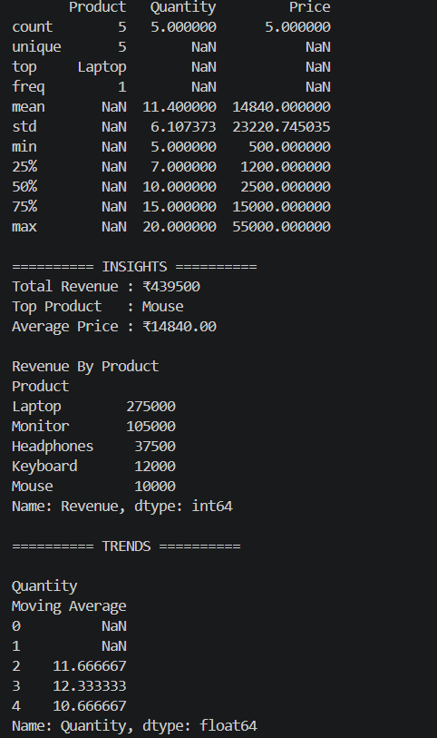
    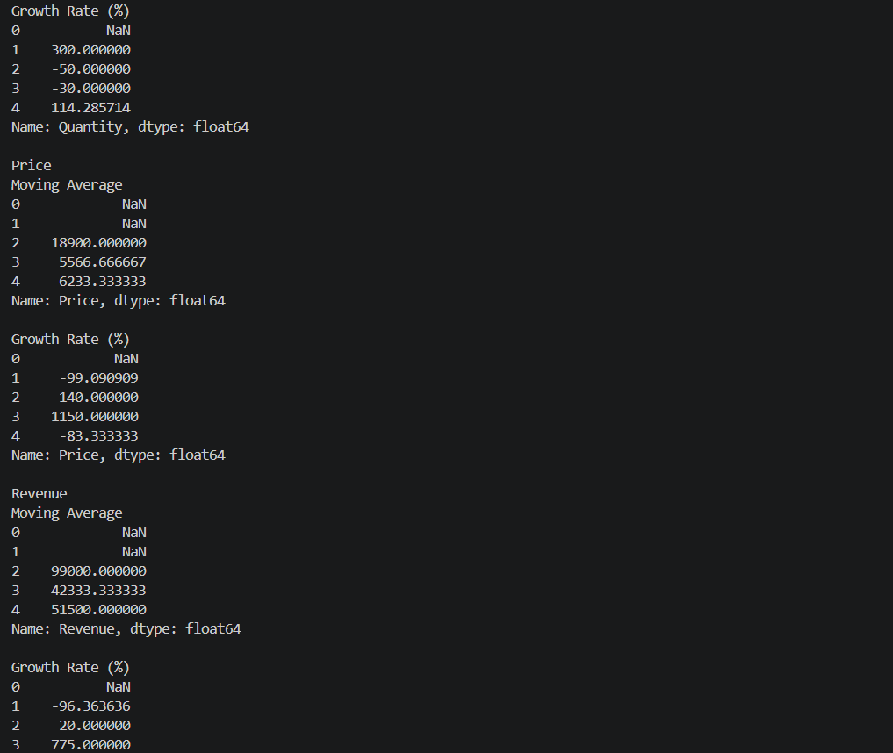


---

## HTML Report

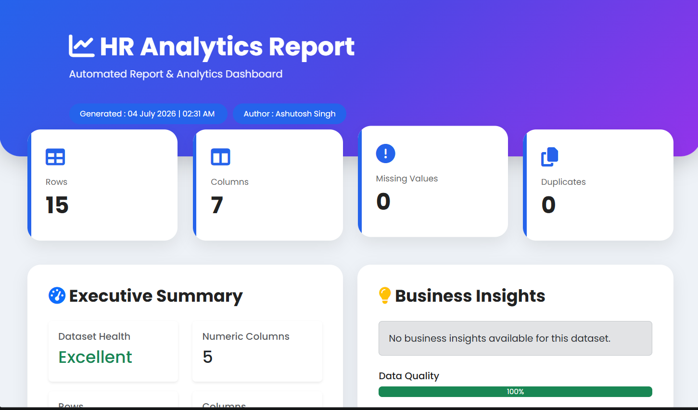
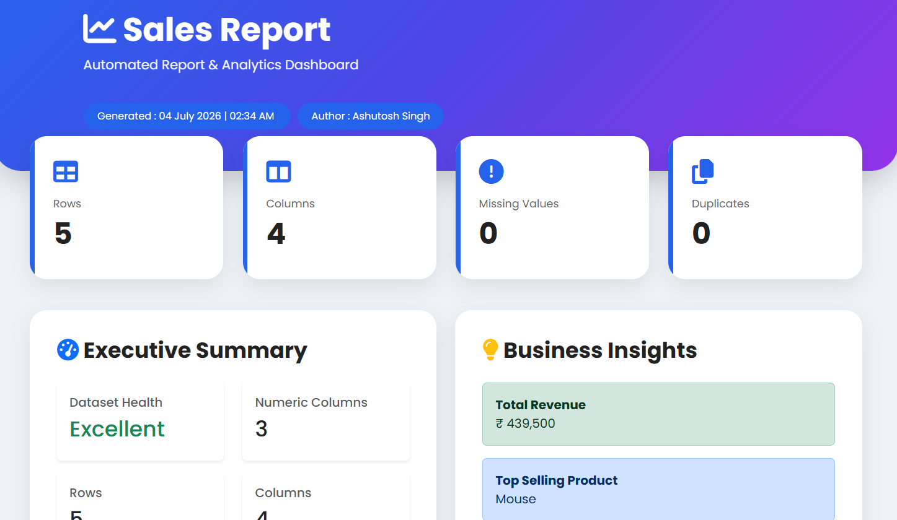


---

## PDF Report

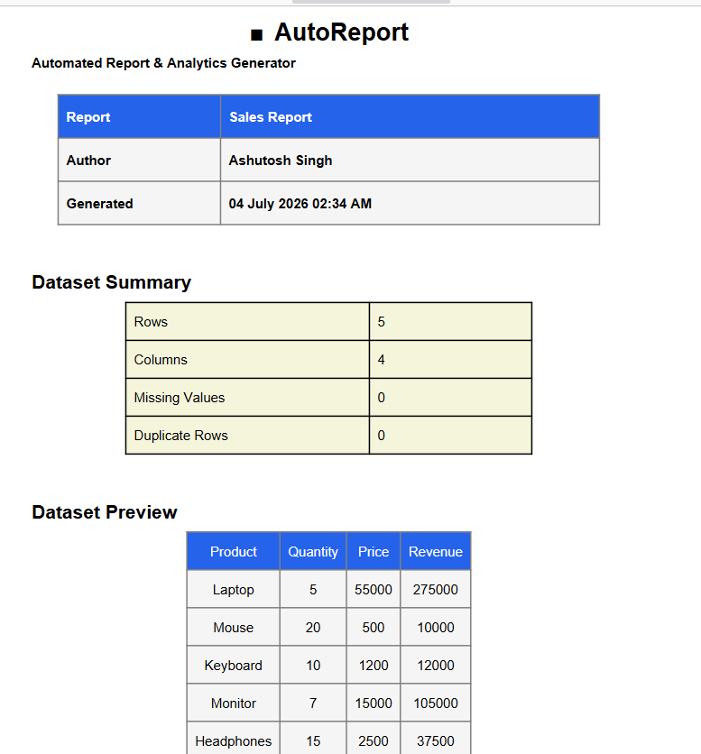

---

## Charts

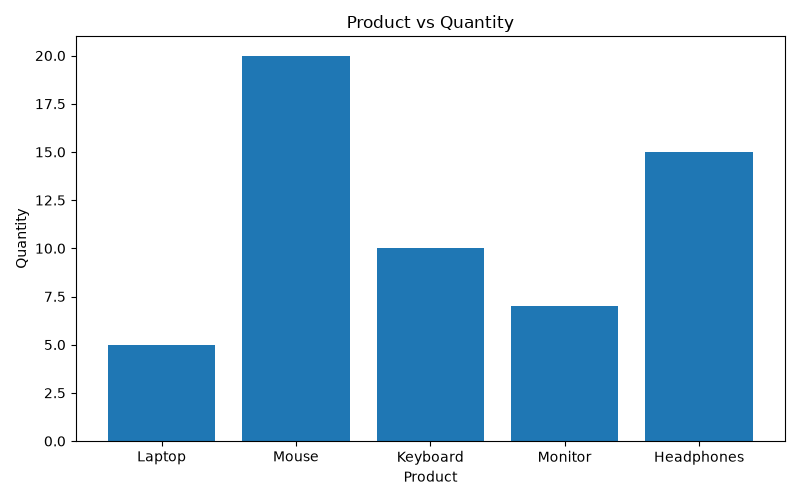
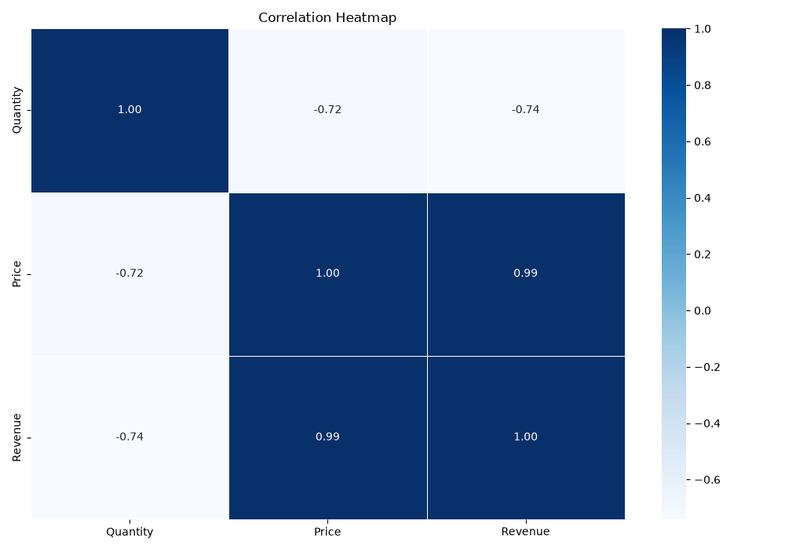
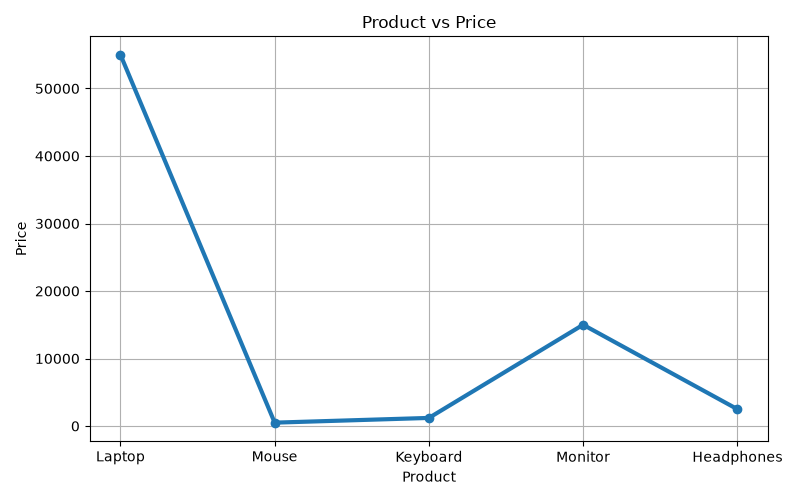
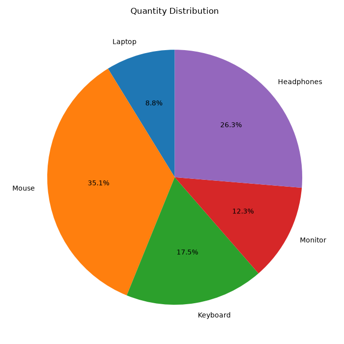
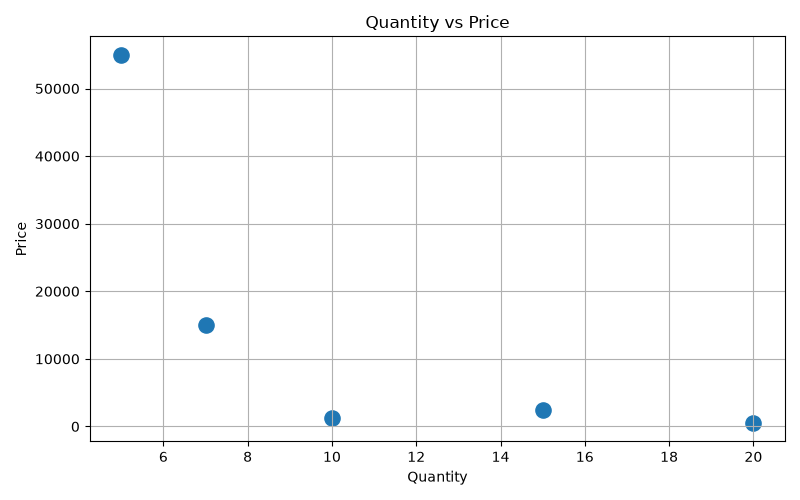
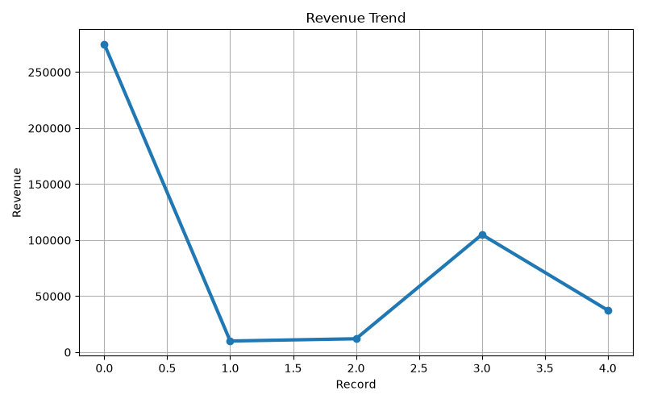

---

# 📌 Supported Templates

- sales.yaml
- hr.yaml
- inventory.yaml

---

# 📌 Supported Data Sources

| Source | Supported |
|---------|-----------|
| CSV | ✅ |
| Excel | ✅ |
| JSON | ✅ |
| SQLite | ✅ |
| REST API | ✅ |

---

# 📌 Supported Charts

| Chart | Supported |
|--------|-----------|
| Bar | ✅ |
| Line | ✅ |
| Pie | ✅ |
| Scatter | ✅ |
| Heatmap | ✅ |
| Revenue | ✅ |
| Trend | ✅ |

---

# 🧪 Running Tests

```bash
pytest
```

---

# 🚀 Future Improvements

- Interactive Dashboard
- Email Report Delivery
- Docker Support
- Machine Learning Insights
- Dashboard Theme Customization
- Export to Excel
- Cloud Storage Support
- Authentication for APIs

---

# 🤝 Contributing

Contributions, suggestions, and improvements are always welcome.

1. Fork the repository
2. Create a new branch
3. Commit your changes
4. Push to your branch
5. Create a Pull Request

---


# 👨‍💻 Author

**Ashutosh Singh**

- GitHub: https://github.com/ashu2506-py
- LinkedIn: https://www.linkedin.com/in/ashutosh25o6

---

## ⭐ If you found this project helpful, consider giving it a Star!
